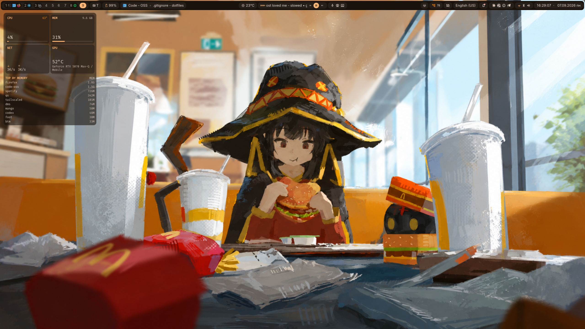

# dotfiles

My personal dotfiles for my Linux setup.


---




---


# Software used


| | |
| ------------------------- | ------------------------------------------------------------------ |
| **Compositor** | [MangoWC](https://github.com/DreamMaoMao/mango) + [DankMaterialShell](mangowc/.config/mango/config.conf) (sourced as `./dms/*.conf`) |
| **Shell** | [Zsh](https://www.zsh.org) + [antidote](https://getantidote.github.io), plugin set based on [Senderman/adhde-zsh-settings](https://github.com/Senderman/adhde-zsh-settings) |
| **Terminal** | [Foot](https://codeberg.org/dnkl/foot) |
| **Text editor** | [Neovim](https://neovim.io) |
| **File manager** | [Yazi](https://yazi-rs.github.io) |
| **Fuzzy finder** | [Television](https://github.com/alexpasmantier/television) |
| **Launcher** | [Fuzzel](https://codeberg.org/dnkl/fuzzel) |
| **Screenshot** | `rishot`  (custom patched) |
| **Clipboard** | wl-clipboard + [Cliphist](https://github.com/sentriz/cliphist) |
| **Audio** | PipeWire + WirePlumber |
| **Backups** | [rustic](https://rustic.cli.rs) via [my-rustic](scripts/.local/bin/scripts/my-rustic) |
| **Process supervision** | [s6 / s6-rc](https://skarnet.org/software) via [usertree](scripts/.local/bin/scripts/usertree) |
| **Package manager helper** | [yay](https://github.com/Jguer/yay) |

  

# Installation

  

This repo is designed to be used with [GNU Stow](https://www.gnu.org/software/stow/).

  

To learn how to manage dotfiles using stow, read [this article written by Alex Pearce](https://alexpearce.me/2016/02/managing-dotfiles-with-stow).

  

But here's quick start:

  

```

cd ~ # you NEED to clone the repo to the $HOME directory

git clone https://github.com/Vezono/dotfiles.git

cd dotfiles

stow zsh

```

  

This will symlink `~/dotfiles/zsh/*` to `$HOME`. Since you probably already have a `~/.config` directory, you will get a `~/.config/zsh` directory which is a symlink to `~/dotfiles/zsh/.config/zsh`:

  

```

~ $ readlink .config/zsh

../dotfiles/zsh/.config/zsh

```

  

if you want to uninstall a symlinked module, run `stow -D zsh`. This will never delete files that don't belong to this repository.

  

You're welcome to fork this repo, edit the dotfiles, add your own, and open a PR :)

  

# Move your config files to the dotfiles repository

  

This repository contains my script called [stowlink](scripts/.local/bin/scripts/stowlink) which can help you move an existing configuration file/directory into the dotfiles repo and stow it in one command.

  

E.g. if you want to move and symlink your waybar config into the dotfiles repository, all you need to do is run:

  

```bash

stowlink .config/waybar mangowc

```

  

Also check out my friend [Senderman](https://github.com/Senderman)'s [dotfiles](https://github.com/Senderman/dotfiles) — a big part of this repo's structure (and the `stowlink` idea itself) grew out of sharing setups with her.

  

# Packages

  

Package names below are for  pacman / AUR. 

  

## Base (needed for basically everything here)

  

| Package | Why |
| --- | --- |
| `zsh` | shell |
| `git` | git |
| `stow` | dotfile symlink management |
| `s6`, `s6-rc`, `s6-linux-init` (AUR) | process supervision used by [`usertree`](scripts/.local/bin/scripts/usertree) |
| `dbus` | session bus, required by almost every service in `s6/sv/*` |
| `wpctl` → part of `wireplumber` | audio control (`changevolume`) |
| `pipewire`, `pipewire-pulse`, `wireplumber` | audio stack (s6 services) |
| `xdg-desktop-portal`, `xdg-desktop-portal-gtk`, `xdg-desktop-portal-wlr` | portals bundle (s6 `portals` bundle) |
| `xdg-user-dirs` | provides `user-dirs.dirs`/`user-dirs.locale` handling |
| `gnupg` | `gpg-agent` s6 service |
| `openssh` | `ssh-agent` s6 service |
| `util-linux` | `lsblk`, `uuidgen` (base install, usually already present) |
| `cryptsetup` | LUKS mount/unmount in `mounter`/`unmounter` |
| `curl` | `rogers-outage` script |
| `execline` | s6 run scripts are execline scripts |

  

## Per-module

  

### `mangowc/`

- `mangowc` (AUR, e.g. `mangowc-git`) — the compositor itself. 

- `waybar`

- `dunst`

- `fuzzel`

- `wl-clipboard` (`wl-copy`/`wl-paste`)

- `cliphist` (AUR)

- `wl-clip-persist` (AUR)

- `wiremix`

- `playerctl`

- `fcitx5`, `fcitx5-im`, `fcitx5-qt`, `fcitx5-gtk` — input method, referenced in `envs.conf`

- `qt5ct` — `QT_QPA_PLATFORMTHEME` in `envs.conf`

- `telegram-desktop` — bound to `SUPER+m`

- `firefox` — bound to `SUPER+b`

- `dms-shell` + `quickshell` 

- `valent` — invoked in `s6/sv/valent-srv`
  

### `zsh/`

- `antidote` — plugin manager, sourced in `.zshrc`

- `fzf` — key-bindings sourced from `/usr/share/fzf` in `.zshrc`

- `zoxide` — aliased as `cd`

- `eza` — aliased as `ls`

- `rustic` — `my-rustic` script


### `yazi/`

- `yazi`

- `mount.yazi` → `udisks2`

- `chmod.yazi`, `git.yazi`, `mime-ext.yazi`, `piper.yazi`, `preview-audio.yazi`, `sel-size.yazi`, `torrent-preview.yazi`: `7zip`/`unarchiver`, `poppler`, `ffmpegthumbnailer`, `jq`, `fd`, `ripgrep`
  

### `scripts/`

- `simple-mtpfs` (AUR) — Android phone mounting in `mounter`/`unmounter`

- `img2pdf` — [`folders2pdf`](scripts/.local/bin/scripts/folders2pdf) converts folders of JPGs to PDF.

- `rustic` — [`my-rustic`](scripts/.local/bin/scripts/my-rustic)